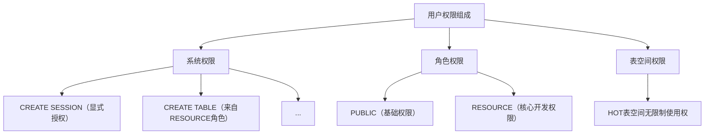

# DM数据库

## 命令行工具

```bash
./disql username/password@ip:port
```

```sql
conn username/password;

-- 查看达梦数据库运行状态
SELECT STATUS$,* FROM v$instance;
-- 查看数据库版本
SELECT BANNER,* FROM v$version;
```

## 一、数据库用户(USER)

### 1. 用户管理

```sql
-- 创建用户
CREATE USER [IF NOT EXISTS] <用户名> IDENTIFIED BY "密码";

-- 查询用户
-- 查询当前用户信息
SELECT * FROM USER_USERS;
SELECT user FROM DUAL;

-- 查询所有用户信息视图字典：
SELECT * FROM ALL_USERS;
SELECT * FROM DBA_USERS;

-- 切换当前用户
conn username/password;

-- 退出登录：logout 或者 disconn 命令

-- 修改用户密码
ALTER USER <用户名> IDENTIFIED BY 新密码;

-- 删除用户
DROP USER [IF EXISTS] <用户名> CASCADE;
```

### 2. 权限管理

> [!NOTE]
>
> - 用户权限有两类：数据库权限和对象权限。
> - 通过 GRANT 语句将权限( 包括数据库权限、对象权限以及角色权限) 分配给用户和角色，之后可以使用 REVOKE 语句将授出的权限再进行收回。
> - DM 数据库用户可以通过动态视图 **V$AUTHORITIES **来查询当前数据库中的所有权限，对应字段 ID(权限主键)、NAME(权限名称)、TYPE(权限类型 1表示数据库权限 2表示对象权限)

```sql
-- 新增用户授权
GRANT 权限信息 TO 用户名;
-- 撤销用户权限
REVOKE 权限信息 FROM 用户名;
-- 锁定/解锁用户
ALTER USER 用户姓名 ACCOUNT LOCK/UNLOCK;

-- 查看用户权限
SELECT * FROM DBA_SYS_PRIVS WHERE GRANTEE = 'HOT';
-- 查看用户角色
SELECT * FROM DBA_ROLE_PRIVS WHERE GRANTEE = 'HOT';

-- 跨模式查询
GRANT SELECT ANY TABLE TO "HOT";
-- 跨模式插入
GRANT INSERT ANY TABLE TO "HOT";
```

> [!IMPORTANT]
>
> **注意事项**：
>
> 1. 使用`ANY`类权限（如`SELECT ANY TABLE`）会跨越模式权限控制，生产环境需谨慎授予
> 2. 建议优先通过角色（ROLE）管理权限，而非直接授予用户
> 3. 通过 `SELECT * FROM DBA_SYS_PRIVS` 可查看完整权限列表

### 权限示意图




### 权限基础信息

#### **基础连接权限**

| 权限名称         | 作用描述                                                     |
| ---------------- | ------------------------------------------------------------ |
| `CREATE SESSION` | **核心权限**：允许用户连接到数据库实例（无此权限将无法登录） |

------

#### **对象创建权限**

| 权限名称           | 作用描述                   |
| ------------------ | -------------------------- |
| `CREATE TABLE`     | 允许在用户自己模式下创建表 |
| `CREATE ANY TABLE` | 允许在任何模式下创建表     |
| `CREATE VIEW`      | 允许创建视图               |
| `CREATE INDEX`     | 允许在自有表上创建索引     |
| `CREATE SEQUENCE`  | 允许创建序列               |
| `CREATE PROCEDURE` | 允许创建存储过程/函数      |
| `CREATE TRIGGER`   | 允许创建触发器             |

------

#### **数据操作权限**

| 权限名称           | 作用描述                           |
| ------------------ | ---------------------------------- |
| `SELECT ANY TABLE` | 允许查询所有模式的表（跨模式读取） |
| `INSERT ANY TABLE` | 允许向所有模式的表插入数据         |
| `UPDATE ANY TABLE` | 允许更新所有模式的表数据           |
| `DELETE ANY TABLE` | 允许删除所有模式的表数据           |

------

#### **管理类权限**

| 权限名称               | 作用描述                                           |
| ---------------------- | -------------------------------------------------- |
| `ALTER USER`           | 允许修改用户密码/属性                              |
| `ALTER TABLESPACE`     | 允许修改表空间属性                                 |
| `UNLIMITED TABLESPACE` | 允许无限制使用所有表空间（默认无此权限需单独授权） |

#### **常用角色说明**

| 角色名称     | 包含的核心权限                                               |
| ------------ | ------------------------------------------------------------ |
| **PUBLIC**   | 基础权限：包含`SELECT`系统视图、`EXECUTE`部分系统包等        |
| **RESOURCE** | 开发权限：包含`CREATE TABLE`、`CREATE VIEW`、`CREATE INDEX`等对象创建权限 |
| **DBA**      | 管理员权限：包含绝大多数系统权限（慎用）                     |
| **SOI**      | 包括对数据库中表、视图的基础访问权限；`SELECT`, `INSERT`, `UPDATE`, `DELETE` |
| SVI          | `CREATE VIEW`, 对特定视图的`SELECT`, `INSERT`, `UPDATE`, `DELETE`权限。创建和操作视图的能力 |
| VTI          | 执行与外部表相关的操作权限，这通常涉及到更高级别的权限管理，因为需要连接外部资源 |


## 二、模式(SCHEMA)

```sql
-- 创建模式，并赋予用户“SYSDBA”对该模式的访问权限！（当前登录数据库的用户是其它账号 SYSDBA）
CREATE SCHEMA <模式名> AUTHORIZATION SYSDBA;

-- 切换当前用户当前活动的模式：
SET SCHEMA "<模式名>";

-- 为当前模式创建表，并且插入数据：
CREATE TABLE test2_table1(tid INT);
INSERT INTO test2_table1 VALUES (666);

-- Ps: 如果用户处于当前模式下，则查询语句模式下的表时，表名前面可以不添加模式名称！
SELECT * FROM "test2"."test2_table1";

-- 删除 test 模式及其所有内容 - 传值 cascade 关键字时，表示连同该模式中的所有对象一并删除
SET SCHEMA SYSDBA;  -- Ps: 这里需要注意，删除某些模式前，指定模式下不能处于“当前状态”，需要切到其它模式后再操作！
DROP SCHEMA <模式名> CASCADE;

-- 查看当前所处模式
SELECT SESSION_USER;

-- 询当前数据库中所有的模式列表
SELECT * FROM SYSOBJECTS WHERE TYPE$='SCH';
```

